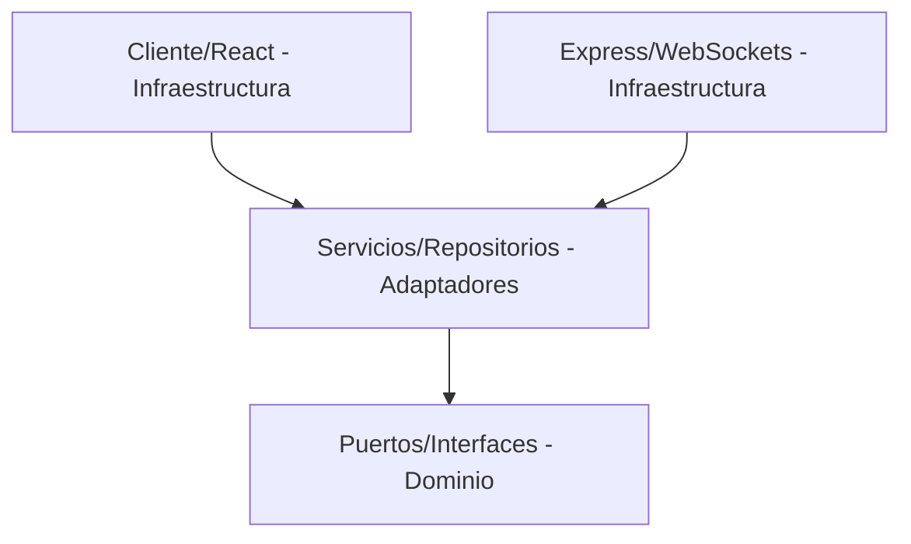

# Clean Architecture (Arquitectura Limpia)

Esta habilidad asegura que la estructura de capas del software y sus límites lógicos se respeten rigurosamente durante cualquier cambio o adición al codebase.

## Capas de la Aplicación

El proyecto se divide en tres capas con responsabilidades bien diferenciadas. La regla de oro es: **las dependencias siempre apuntan hacia adentro**.

### 1. Capa de Dominio (`Domain`)
* **Ubicación**: [`server/src/domain/`](file:///d:/workspace/codiredes/pz/server/src/domain/)
* **Contenido**: Puertos (`ports/`) e interfaces base que definen los contratos de la aplicación.
* **Regla**: Esta capa es 100% pura. No debe importar ninguna librería externa (salvo utilidades básicas de tipos), frameworks, base de datos ni librerías del sistema de archivos (`fs`, `child_process`).

### 2. Capa de Adaptadores (`Adapters`)
* **Ubicación**: [`server/src/adapters/`](file:///d:/workspace/codiredes/pz/server/src/adapters/)
* **Contenido**: Implementaciones concretas de los puertos del dominio. Incluye repositorios de datos (como `PzInstanceRepository.ts`) y servicios de negocio (como `PzInstanceService.ts`).
* **Regla**: Depende únicamente de los puertos del dominio. Mapea la entrada y salida de datos a formatos estándar del dominio y coordina las reglas de negocio.

### 3. Capa de Infraestructura / Web (`Frameworks`)
* **Ubicación**: [`server/src/frameworks/`](file:///d:/workspace/codiredes/pz/server/src/frameworks/)
* **Contenido**: Express API, servidores WebSocket, middleware de autenticación, y el cliente frontend de React/Vite.
* **Regla**: Es la capa más externa de la aplicación. Configura la inyección de dependencias pasando los adaptadores a los casos de uso para que la infraestructura se mantenga desacoplada de la lógica del negocio.
