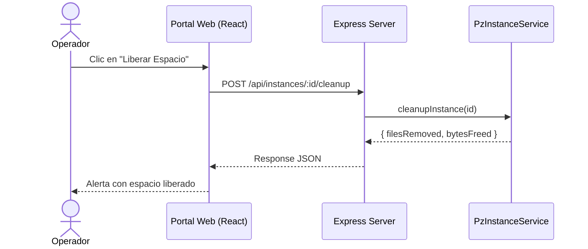

# TDD, BDD y SSD en el Ciclo de Desarrollo

Esta habilidad se activa cuando el agente realiza adiciones, modificaciones o pruebas funcionales/unitarias. Garantiza el uso sistemático de desarrollo guiado por pruebas y diagramas de secuencia para verificar la integración.

## Directrices Clave

### 1. TDD (Test-Driven Development)
Sigue el ciclo de Red-Green-Refactor para cualquier nueva funcionalidad:
1. **Rojo (Red)**: Escribe una prueba unitaria o de integración para el comportamiento esperado antes de escribir el código de producción. Ejecuta las pruebas y verifica que falle por el motivo correcto.
2. **Verde (Green)**: Escribe la mínima cantidad de código de producción necesario para hacer que la prueba pase.
3. **Refactor**: Limpia el código de producción y las pruebas manteniendo el verde (sin romper el comportamiento).

### 2. BDD (Behavior-Driven Development)
Describe los requerimientos e historias de usuario usando escenarios legibles con la sintaxis **Given-When-Then**:
* **Given (Dado)**: El estado inicial o prerrequisitos del sistema.
* **When (Cuando)**: La acción o evento ejecutado por el usuario o proceso.
* **Then (Entonces)**: El resultado esperado y cambios observables en el sistema.

*Ejemplo en pruebas unitarias*:
```typescript
describe('Creación de Backup', () => {
  it('Dado un servidor activo, Cuando se solicita un backup manual, Entonces se genera el archivo .zip en el directorio correcto', async () => { ... });
});
```

### 3. SSD (System Sequence Diagrams / Diagramas de Secuencia del Sistema)
Antes de implementar flujos complejos que involucren múltiples servicios u endpoints, documenta el flujo en la propuesta con un diagrama de secuencia Mermaid para validar el orden de llamadas:



### 4. Cobertura Mínima de Pruebas (80%)
* Cualquier archivo nuevo o modificado (servicios, repositorios, utilidades) debe contar con una cobertura de pruebas unitarias o de integración de **al menos el 80% de sus líneas y ramas**.
* Las pruebas deben correrse localmente con `npm run test` antes de considerar completada cualquier tarea.
